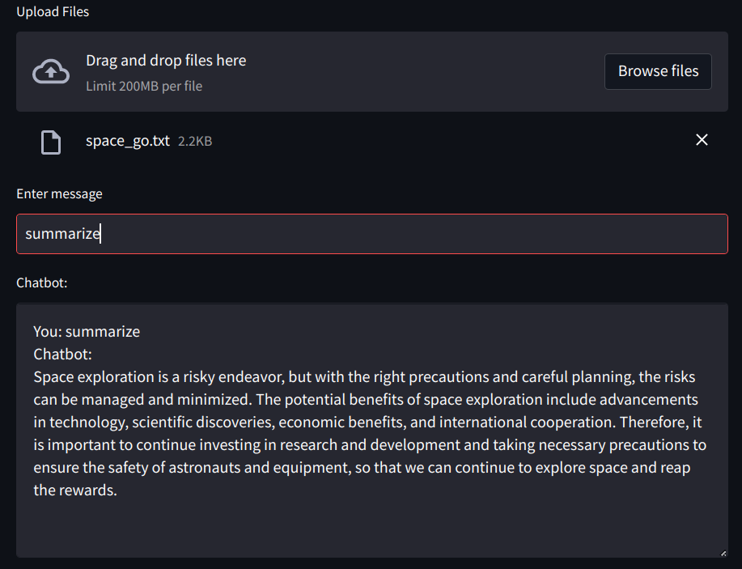

# Llama_Index tests

## A small collection of tools for chatting with files based on Llama_Index

Some easy to make / easy to use tools for chatting with files. 

1. 'simpleQA.ipynb': Simple QA iPython notebook based on Llama_index with less than 10 lines of code. No external vectorstore required.
2. 'simpleQA_gr.py': Simple QA Python code based on Llama_index and using Gradio for simple UI. No external vectorstore required.
3. 'simpQA_streamlit.py': Simple QA Python code based on Llama_index and using Streamlit for simple UI. Can upload one or multiple files at the same time, and the files can be .txt, .pdf, etc. No external vectorstore required. To run it, type: ```streamlit run simpQA_streamlit.py```

## Screenshot

