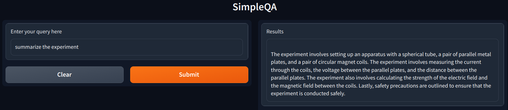

# Llama_Index tests

## A small collection of tools for chatting with files based on Llama_Index

Some easy to make / easy to use tools for chatting with files. 

1. 'simpleQA.ipynb': Simple QA iPython notebook based on Llama_index with less than 10 lines of code. No API key required. No external vectorstore required.
2. 'simpleQA_gr.py': Simple QA Python code based on Llama_index and using Gradio for simple UI. No API key required. No external vectorstore required.

## Screenshot
